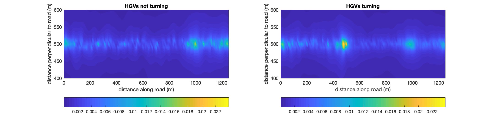
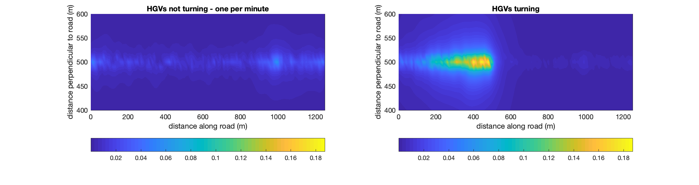

# Traffic Modelling

Several years ago I wrote a model for predicting the flow of traffic down a road. The model is written in MATLAB.

# Table of contents
1. [Overview](#overview)
2. [Dependencies](#Dependencies)
3. [Folder structure](#Folder-Structure)
4. [Code of Conduct](#Code-of-Conduct)

## Overview <a name="overview"></a>

The model predicted the flow of traffic down a straight road in the suburbs. It takes into account the acceleration and deceleration of different vehicles. The main usage <i>was</i> for predicting noise levels; however, this can also be used to predict air quality by combining the vehicle locations with a gaussian plume model.

The accelerations of vehicles are scaled as follows:

$a=\frac{|v-u|}{150\times acc_{peak}}$

where $u$ is the initial speed, and $v$ is the final speed. This is done so vehicles do not crash or run through red traffic lights (as long as they are within an adequate stopping distance).

## Dependencies <a name="Dependencies"></a>

The model is written in MATLAB. When run from the MATLAB directory the following code will generate a plot of pollutant concentration

First, set the second input to greenlanetraffic to 0 on line 13 of road_pollution, save. The 0 means that HGVs do not turn into the site. Then type in MATLAB

```
fig=figure
subplot(121)
road_pollution
title('HGVs not turning')    
xlabel('distance along road (m)')
ylabel('distance perpendicular to road (m)')
shading interp
ylim([400 600])
colorbar('horiz')
c1=caxis;
```

after this you can change the second input to 1 (meaning HGVs turn into a site) and type:


```
figure(fig)
subplot(122)
road_pollution
title('HGVs turning')    
xlabel('distance along road (m)')
ylabel('distance perpendicular to road (m)')
shading interp
ylim([400 600])
colorbar('horiz')
c2=caxis;
c=max(c1,c2);
caxis(c);
subplot(121)
caxis(c);
```

The resultant graphs should appear as follows:



*Figure 1: notice the clustering around 450 m on the right plot and at two locations near the end - traffic lights*



*Figure 2: notice the large clustering around 450 m*


## Folder structure <a name="Folder-Structure"></a>

The repository structure is now discussed. Each project has its own directory. The idea is that each of these projects will have a README file explaining the project and some additional resources. This will be built up over time.

### Directory layout

                             
    ├── documents							# supporting documents
    ├── matlab_traffic						# MATLAB model
    └── README.md							# this readme
----------

## Code of Conduct<a name="Code-of-Conduct"></a>

To be arranged.